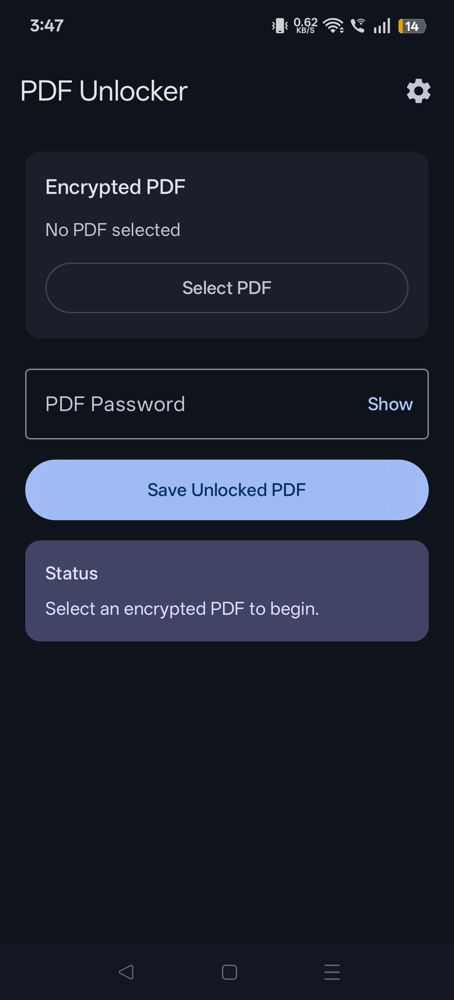
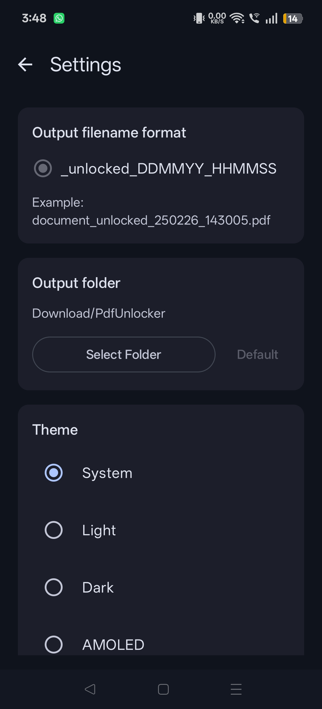
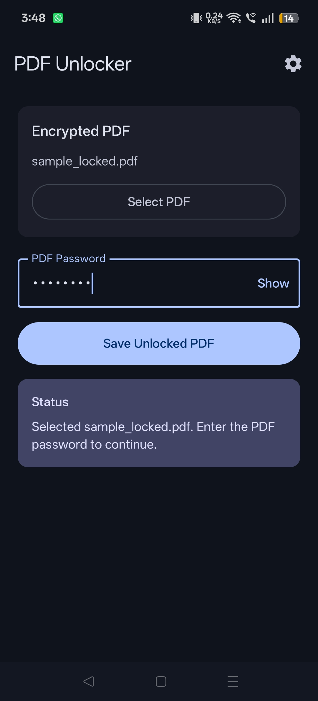

# PDF Unlocker

A simple, fast, and privacy-focused Android app for removing passwords from PDF files when you know the correct password.

## Features

* Open password-protected PDF files
* Remove PDF password protection
* Save an unlocked copy to your device
* Material 3 user interface
* Fully offline processing
* No account required
* No internet connection required

## Screenshots

  
  
  
  
  

## Download

Download the latest APK from the GitHub Releases page.

## How It Works

1. Select a password-protected PDF.
2. Enter the correct password.
3. Unlock the PDF.
4. Save the unlocked copy.

The original PDF is never modified.

## Privacy

PDF Unlocker works entirely on your device.

* No data is uploaded.
* No cloud processing.
* No analytics.
* No tracking.

## Requirements

* Android 10 (API 29) or later

## Open Source Libraries

* PDFBox Android
* Android Jetpack Compose
* Material 3
* Android DataStore

## License

Licensed under the Apache License 2.0. See the LICENSE file for details.

## Project

GitHub: https://github.com/OpenAppex/pdfunlocker
